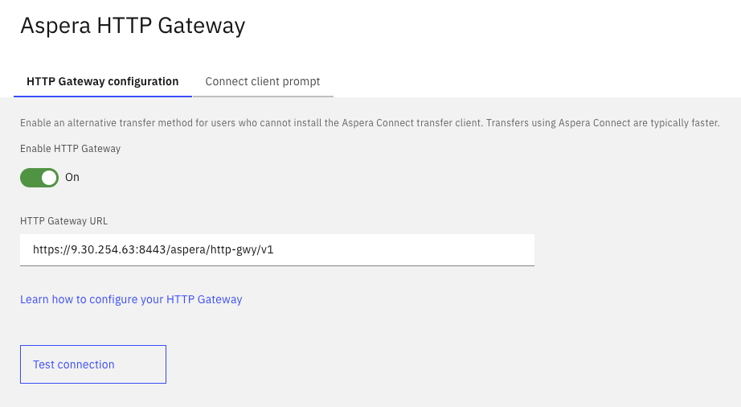

# HTTP Gateway

Diagram below shows a typical setup of HTTP gateway with Faspex and HSTS (with and without HTTP Gateway.   
   

Ref.: [https://www.ibm.com/docs/en/aspera-http-gateway/2.3](https://www.ibm.com/docs/en/aspera-http-gateway/2.3)   

## Prerequisites
1. Have a standard Faspex and HSTS installed. Refer to [https://github.com/IBMIntegration/aspera-academy](https://github.com/IBMIntegration/aspera-academy) for help on this.   
2. A computer with Redhat 9.x or Rocky 9.x (for HTTP Gateway)
3. A Client machine (Windows / MAC / Linux) with a browser to test. 
4. IBM Aspera Connect (required ONLY if need to compare results) installed in the client machine. 

## Deployment and Setup.  

1. Download HTTP Gateway from FixCentral and install. Link to download: [https://www.ibm.com/products/aspera/downloads](https://www.ibm.com/products/aspera/downloads)   

        Install:
        rpm -Uvh ibm-aspera-httpgateway-*.x86_64.rpm   

2. Create a copy of configuration from the default configuration file.    

        cd /opt/aspera/httpgateway/config
        cp default.properties gatewayconfig.properties     
        Edit the gatewayconfig.properties file and change the 
        
        serverconfig.port=8443

        There is limit in the product to use this specific port.   

3. Additional Step needed for HTTP Gateway version 2.3.1 and older.   
        The ascp binary included in the Gateway is pretty old and may not support some of the newer algorithms. Hence use the ascp binary attached here.   

        Download [ascp](./ascp)
        cp ascp /opt/aspera/httpgateway/aspera
        chmod 755 /opt/aspera/httpgateway/aspera

4. Restart the HTTP Gateway.  

        systemctl start aspera_httpgateway  

5. Add the public key to authorized keys of faspex transfer user. 

        cat /opt/aspera/var/aspera_tokenauth_id_rsa.pub >> /home/faspex/.ssh/authorized_keys         
        

6. Setup Faspex to support HTTP Gateway.  
6.1		Enable HTTP Gateway based transfer in Faspex.    
        From the Admin Application, Go to Configurations -> Aspera HTTP Gateway 

        Turn On HTTP Gateway
        Enter the URL of the HTTP Gateway. It should normally look like this
        https://<IP of HTTP Gateway>:8443/aspera/http-gwy/v1    
        Click on "Test Connection" to check if Faspex is able to connect to HTTP-Gateway.   

4.2	This next step should be done by every user who wishes to use HTTP for file transfers.    

        Login to Faspex. Click on the Profile Image -> Account Setting
        Turn On "Disable Aspera Connect Plugin"    
        Save the changes.   

When these 2 steps are done, your transfers should now use HTTP-Gateway. You do NOT need connect plugin 

5. Test creating a package. You should notice the package being uploaded using HTTP.    

## Test Results
The following table shows a sample test results for various number of files and file sizes.  
All tests were done in a 200mbps connection, 200ms delay, 1% packet loss network.   

Generally, using the HTTP Gateway provides significant improvement against standard HTTP transfers and can be used to accelerate file transfers in an environment where installing the Aspera Connect Plugin is not possible.   
However, using the Aspera Connect Plugin still provides the best file transfer speeds!  

